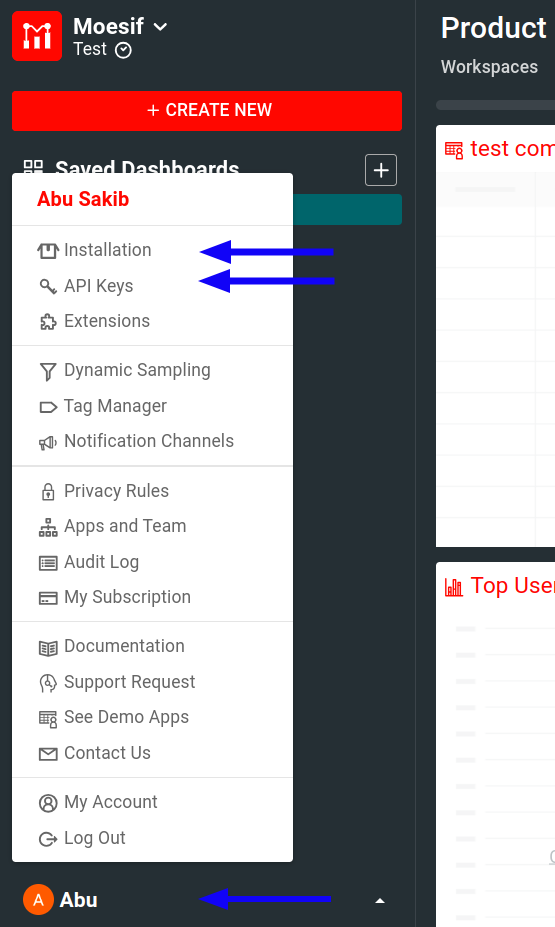

# Moesif Middleware for Python Django
by [Moesif](https://moesif.com), the [API analytics](https://www.moesif.com/features/api-analytics) and [API monetization](https://www.moesif.com/solutions/metered-api-billing) platform.

[![Built For][ico-built-for]][link-built-for]
[![Latest Version][ico-version]][link-package]
[![Language Versions][ico-language]][link-language]
[![Software License][ico-license]][link-license]
[![Source Code][ico-source]][link-source]

Moesif middleware for Django automatically logs incoming and outgoing API calls
and sends them to [Moesif](https://www.moesif.com) for API analytics and monitoring.

This SDK uses the Requests library and works for Python versions 2.7 up to 3.10.4.

> If you're new to Moesif, see [our Getting Started](https://www.moesif.com/docs/) resources to quickly get up and running.

## Prerequisites
Before using this middleware, make sure you have the following:

- [An active Moesif account](https://moesif.com/wrap)
- [A Moesif Application ID](#get-your-moesif-application-id)

### Get Your Moesif Application ID
After you log into [Moesif Portal](https://www.moesif.com/wrap), you can get your Moesif Application ID during the onboarding steps. You can always access the Application ID any time by following these steps from Moesif Portal after logging in:

1. Select the account icon to bring up the settings menu.
2. Select **Installation** or **API Keys**.
3. Copy your Moesif Application ID from the **Collector Application ID** field.


## Install the Middleware

Install with pip:

```shell
pip install moesifdjango
```

## Configure the Middleware
See the available [configuration options](#configuration-options) to learn how to configure the middleware for your use case.

## How to Use

In your [Django settings file](https://docs.djangoproject.com/en/4.0/topics/settings/#default-settings), add `moesifdjango.middleware.moesif_middleware`
to the [`MIDDLEWARE` array](https://docs.djangoproject.com/en/4.0/topics/http/middleware/#activating-middleware):

```python
MIDDLEWARE = [
    'django.middleware.security.SecurityMiddleware',
    'django.contrib.sessions.middleware.SessionMiddleware',
    'django.middleware.common.CommonMiddleware',
    'django.middleware.csrf.CsrfViewMiddleware',
    'django.contrib.auth.middleware.AuthenticationMiddleware',
    'moesifdjango.middleware.moesif_middleware',
    'django.contrib.messages.middleware.MessageMiddleware',
    'django.middleware.clickjacking.XFrameOptionsMiddleware',
]
```

Because of [middleware execution order](https://docs.djangoproject.com/en/4.0/ref/middleware/#middleware-ordering), we highly recommend that you add `moesif_middleweare` _after_ `SessionMiddleware` and `AuthenticationMiddleware`. These Django middleware add useful session data that enables deeper error analysis. On the other hand, if you have other middleware that modifies responses before going out, you may choose to place Moesif middleware before the middleware that modifies responses. This allows Moesif to see the modifications to the response data and see closer to what goes over the wire.

### Changes in Django 1.10

Django middleware style and setup was refactored in version 1.10. You need need to import the correct version of Moesif middleware depending on your Django version:

- For Django 1.10 or greater, use `moesifdjango.middleware.moesif_middleware`.
- For Django 1.9 or older, you need to follow the legacy style for importing middleware and use `moesifdjango.middleware_pre19.MoesifMiddlewarePre19` instead.

To find your current Django version, you can execute the following command in your terminal:

```sh
python -c "import django; print(django.get_version())"
```

### Django 1.10 or Newer

Django 1.10 renamed `MIDDLEWARE_CLASSES` to `MIDDLEWARE.` Therefore, for Django 1.10 or newer, you must [activate your middleware](https://docs.djangoproject.com/en/4.0/topics/http/middleware/#activating-middleware) by adding it to the `MIDDLEWARE` list:

```python
MIDDLEWARE = [
    ...,
    'django.contrib.sessions.middleware.SessionMiddleware',
    'django.middleware.common.CommonMiddleware',
    'django.contrib.auth.middleware.AuthenticationMiddleware',
    'moesifdjango.middleware.moesif_middleware'
    ...
]
```

Then add a dictionary `MOESIF_MIDDLEWARE` to your Django settings file:

```
MOESIF_MIDDLEWARE = {
    'APPLICATION_ID': 'YOUR_MOESIF_APPLICATION_ID',
    'LOG_BODY': True,
}
```

### Django 1.9 or Older

[Activate the middleware](https://docs.djangoproject.com/en/1.8/topics/http/middleware/#activating-middleware) by adding it to the `MIDDLEWARE_CLASSES` list in your Django settings file:

```
MIDDLEWARE_CLASSES = [
    ...,
    'moesifdjango.middleware_pre19.MoesifMiddlewarePre19',
    # other middlewares
]
```

Then add a dictionary `MOESIF_MIDDLEWARE` to your Django settings file:
```

MOESIF_MIDDLEWARE = {
    'APPLICATION_ID': 'YOUR_MOESIF_APPLICATION_ID',
    'LOG_BODY': True,
}
```

The dictionary contains the [configuration options](#configuration-options) for
the middleware, including your [Moesif Application ID](#get-your-moesif-application-id) that you must specify.

### Optional: Capturing Outgoing API Calls
In addition to your own APIs, you can also start capturing calls out to third party services through by setting the [`CAPTURE_OUTGOING_REQUESTS` option](#capture_outgoing_requests).

For configuration options specific to capturing outgoing API calls, see [Options For Outgoing API Calls](#options-for-outgoing-api-calls).

## Troubleshoot
For a general troubleshooting guide that can help you solve common problems, see [Server Troubleshooting Guide](https://www.moesif.com/docs/troubleshooting/server-troubleshooting-guide/).

Other troubleshooting supports:

- [FAQ](https://www.moesif.com/docs/faq/)
- [Moesif support email](mailto:support@moesif.com)

### Solve Timezone Issue with Docker
When using Docker with Ubuntu-based image, events may not be captured if the image fails to find any timezone configuration. To solve this issue, add the following line to your Dockerfile:

```
ENV TZ=UTC
```

Otherwise, you can add `RUN apt-get install tzdata` in the Dockerfile.

## Repository Structure

```
.
├── BUILDING.md
├── images/
├── LICENSE
├── MANIFEST.in
├── moesifdjango/
├── pull_request_template.md
├── README.md
├── requirements.txt
├── setup.cfg
├── setup.py
└── tests/
```

## Configuration options
The following sections describe the available configuration options for this middleware. You have to set these options in a Python dictionary `MOESIF_MIDDLEWARE`. See the [examples](#examples) for better understanding.

#### `APPLICATION_ID` (Required)
<table>
  <tr>
   <th scope="col">
    Data type
   </th>
  </tr>
  <tr>
   <td>
    String
   </td>
  </tr>
</table>

A string that [identifies your application in Moesif](#get-your-moesif-application-id).

### Options specific to Incoming API Calls
The following options document the configuration options to use for incoming API calls.

Several options use request and response as input arguments. These correspond to [Django's request and response objects](https://docs.djangoproject.com/en/1.10/ref/request-response/).

#### `SKIP`
<table>
  <tr>
   <th scope="col">
    Data type
   </th>
   <th scope="col">
    Parameters
   </th>
   <th scope="col">
    Return type
   </th>
  </tr>
  <tr>
   <td>
    Function
   </td>
   <td>
    <code>(request, response)</code>
   </td>
   <td>
    Boolean
   </td>
  </tr>
</table>

Optional.

This function takes Requests [`Request` and `Response` objects](https://requests.readthedocs.io/en/latest/user/advanced/#request-and-response-objects) and returns `True` if you want to skip this particular event.

#### `IDENTIFY_USER`
<table>
  <tr>
   <th scope="col">
    Data type
   </th>
   <th scope="col">
    Parameters
   </th>
   <th scope="col">
    Return type
   </th>
  </tr>
  <tr>
   <td>
    Function
   </td>
   <td>
    <code>(request, response)</code>
   </td>
   <td>
    String
   </td>
  </tr>
</table>

Optional, but highly recommended.

This function takes a request and a response and returns a string that represents
the user ID used by your system.

Moesif tries to identify users automatically and fetch the username from [`django.http.HttpRequest.user`](https://docs.djangoproject.com/en/1.8/ref/request-response/#django.http.HttpRequest.user). However, if implementation differs, we highly recommend that you accurately provide a
user ID using this function.

#### `IDENTIFY_COMPANY`
<table>
  <tr>
   <th scope="col">
    Data type
   </th>
   <th scope="col">
    Parameters
   </th>
   <th scope="col">
    Return type
   </th>
  </tr>
  <tr>
   <td>
    Function
   </td>
   <td>
    <code>(request, response)</code>
   </td>
   <td>
    String
   </td>
  </tr>
</table>

Optional.

A function that takes a request and a response and returns a string that represents the company ID for this event.

#### `GET_SESSION_TOKEN`
<table>
  <tr>
   <th scope="col">
    Data type
   </th>
   <th scope="col">
    Parameters
   </th>
   <th scope="col">
    Return type
   </th>
  </tr>
  <tr>
   <td>
    Function
   </td>
   <td>
    <code>(request, response)</code>
   </td>
   <td>
    String
   </td>
  </tr>
</table>

Optional.

A function that takes a request and a response, and returns a string that represents the session token for this event.

Similar to [user IDs](#identify_user), Moesif tries to get the session token automatically. However, if you setup differs from the standard, this function can help tying up events together and help you replay the events.

#### `GET_METADATA`
<table>
  <tr>
   <th scope="col">
    Data type
   </th>
   <th scope="col">
    Parameters
   </th>
   <th scope="col">
    Return type
   </th>
  </tr>
  <tr>
   <td>
    Function
   </td>
   <td>
    <code>(request, response)</code>
   </td>
   <td>
    Dictionary
   </td>
  </tr>
</table>

Optional.

A function that takes a request and a response and returns a Python dictionary.

The dictionary must be such that it can be converted into valid JSON. This allows you to associate this event with custom metadata. For example, you may want to save a virtual machine instance ID, a trace ID, or a tenant ID with the request.

#### `LOG_BODY`
<table>
  <tr>
   <th scope="col">
    Data type
   </th>
   <th scope="col">
    Default
   </th>
  </tr>
  <tr>
   <td>
    <code>Boolean</code>
   </td>
   <td>
    <code>True</code>
   </td>
  </tr>
</table>

Optional.

Whether to log request and response body to Moesif.

Set to `False` to remove the HTTP body before sending to Moesif.

If you want more control over which fields the middleware includes or not, see the next option `MASK_EVENT_MODEL`.

#### `MASK_EVENT_MODEL`
<table>
  <tr>
   <th scope="col">
    Data type
   </th>
   <th scope="col">
    Parameters
   </th>
   <th scope="col">
    Return type
   </th>
  </tr>
  <tr>
   <td>
    Function
   </td>
   <td>
    <code>(EventModel)</code>
   </td>
   <td>
    <code>EventModel</code>
   </td>
  </tr>
</table>

Optional.

A function that takes the final Moesif event model and returns an `EventModel` object with desired data removed.

Use this if you prefer to write your own mask function than uses the string based filter options:

- `REQUEST_BODY_MASKS`
- `REQUEST_HEADER_MASKS`
- `RESPONSE_BODY_MASKS`
- `RESPONSE_HEADER_MASKS`

The return value must be a valid `EventModel` required by Moesif data ingestion API. For more information about Moesif event model, see [Moesif Python API documentation](https://www.moesif.com/docs/api?python).

#### `BATCH_SIZE`
<table>
  <tr>
   <th scope="col">
    Data type
   </th>
   <th scope="col">
    Default
   </th>
  </tr>
  <tr>
   <td>
    <code>int</code>
   </td>
   <td>
    <code>25</code>
   </td>
  </tr>
</table>

Optional.

Specifies the maximum batch size when sending to Moesif.

#### `EVENT_QUEUE_SIZE`
<table>
  <tr>
   <th scope="col">
    Data type
   </th>
   <th scope="col">
    Default
   </th>
  </tr>
  <tr>
   <td>
    <code>int</code>
   </td>
   <td>
    <code>1000_000</code>
   </td>
  </tr>
</table>

Optional.

The maximum number of events to hold in queue before sending to Moesif.

In case of network issues, the middleware may fail to connect or send event to Moesif. In those cases, the middleware skips adding new to event to queue to prevent memory overflow.

#### `AUTHORIZATION_HEADER_NAME`
<table>
  <tr>
   <th scope="col">
    Data type
   </th>
   <th scope="col">
    Default
   </th>
  </tr>
  <tr>
   <td>
    String
   </td>
   <td>
    <code>authorization</code>
   </td>
  </tr>
</table>

Optional.

A request header field name used to identify the User in Moesif. It also supports a comma separated string. Moesif checks headers in order like `"X-Api-Key,Authorization"`.

#### `AUTHORIZATION_USER_ID_FIELD`
<table>
  <tr>
   <th scope="col">
    Data type
   </th>
   <th scope="col">
    Default
   </th>
  </tr>
  <tr>
   <td>
    String
   </td>
   <td>
    <code>sub</code>
   </td>
  </tr>
</table>

Optional.

A field name used to parse the user from authorization header in Moesif.

#### `BASE_URI`
<table>
  <tr>
   <th scope="col">
    Data type
   </th>
  </tr>
  <tr>
   <td>
    String
   </td>
  </tr>
</table>

Optional.

A local proxy hostname when sending traffic through secure proxy. Remember to set this field when using secure proxy. For more information, see [Secure Proxy documentation.](https://www.moesif.com/docs/platform/secure-proxy/#2-configure-moesif-sdk).

### Options For Outgoing API Calls

The following options apply to outgoing API calls. These are calls you initiate using the Python [Requests](http://docs.python-requests.org/en/master/) library to third parties like Stripe or to your own services.

Several options use request and response as input arguments. These correspond to the [Requests](http://docs.python-requests.org/en/master/api/) library's request or response objects.

If you are not using Django, you can import [`moesifpythonrequest`](https://github.com/Moesif/moesifpythonrequest) directly.

#### `CAPTURE_OUTGOING_REQUESTS`
<table>
  <tr>
   <th scope="col">
    Data type
   </th>
   <th scope="col">
    Default
   </th>
  </tr>
  <tr>
   <td>
    Boolean
   </td>
   <td>
    <code>False</code>
   </td>
  </tr>
</table>

Set to `True` to capture all outgoing API calls.

##### `GET_METADATA_OUTGOING`
<table>
  <tr>
   <th scope="col">
    Data type
   </th>
   <th scope="col">
    Parameters
   </th>
   <th scope="col">
    Return type
   </th>
  </tr>
  <tr>
   <td>
    Function
   </td>
   <td>
    <code>(req, res)</code>
   </td>
   <td>
    Dictionary
   </td>
  </tr>
</table>

Optional.

A function that enables you to return custom metadata associated with the logged API calls.

Takes in the [Requests](http://docs.python-requests.org/en/master/api/) request and response objects as arguments.

We recommend that you implement a function that
returns a dictionary containing your custom metadata. The dictionary must be a valid one that can be encoded into JSON. For example, you may want to save a virtual machine instance ID, a trace ID, or a resource ID with the request.

##### `SKIP_OUTGOING`
<table>
  <tr>
   <th scope="col">
    Data type
   </th>
   <th scope="col">
    Parameters
   </th>
   <th scope="col">
    Return type
   </th>
  </tr>
  <tr>
   <td>
    Function
   </td>
   <td>
    <code>(req, res)</code>
   </td>
   <td>
    Boolean
   </td>
  </tr>
</table>

Optional.

A function that takes a [Requests](http://docs.python-requests.org/en/master/api/) request and response objects,
and returns `True` if you want to skip this particular event.

##### `IDENTIFY_USER_OUTGOING`
<table>
  <tr>
   <th scope="col">
    Data type
   </th>
   <th scope="col">
    Parameters
   </th>
   <th scope="col">
    Return type
   </th>
  </tr>
  <tr>
   <td>
    Function
   </td>
   <td>
    <code>(req, res)</code>
   </td>
   <td>
    String
   </td>
  </tr>
</table>

Optional, but highly recommended.

A function that takes [Requests](http://docs.python-requests.org/en/master/api/) request and response objects, and returns a string that represents the user ID used by your system.

While Moesif tries to identify users automatically, different frameworks and your implementation might vary. So we highly recommend that you accurately provide a
user ID using this function.

##### `IDENTIFY_COMPANY_OUTGOING`
<table>
  <tr>
   <th scope="col">
    Data type
   </th>
   <th scope="col">
    Parameters
   </th>
   <th scope="col">
    Return type
   </th>
  </tr>
  <tr>
   <td>
    Function
   </td>
   <td>
    <code>(req, res)</code>
   </td>
   <td>
    String
   </td>
  </tr>
</table>

Optional.

A function that takes [Requests](http://docs.python-requests.org/en/master/api/) request and response objects and returns a string that represents the company ID for this event.

##### `GET_SESSION_TOKEN_OUTGOING`
<table>
  <tr>
   <th scope="col">
    Data type
   </th>
   <th scope="col">
    Parameters
   </th>
   <th scope="col">
    Return type
   </th>
  </tr>
  <tr>
   <td>
    Function
   </td>
   <td>
    <code>(req, res)</code>
   </td>
   <td>
    String
   </td>
  </tr>
</table>

Optional.

A function that takes [Requests](http://docs.python-requests.org/en/master/api/) request and response objects, and returns a string that corresponds to the session token for this event.

Similar to [user IDs](#identify_user_outgoing), Moesif tries to get the session token automatically. However, if you setup differs from the standard, this function can help tying up events together and help you replay the events.

### General options
#### `LOG_BODY_OUTGOING`
<table>
  <tr>
   <th scope="col">
    Data type
   </th>
   <th scope="col">
    Default
   </th>
  </tr>
  <tr>
   <td>
    Boolean
   </td>
   <td>
    <code>True</code>
   </td>
  </tr>
</table>

Optional.

Set to `False` to remove logging request and response body.

#### `LOCAL_DEBUG`
<table>
  <tr>
   <th scope="col">
    Data type
   </th>
  </tr>
  <tr>
   <td>
    Boolean
   </td>
  </tr>
</table>

Optional.

Set to `True` to print internal log messages for debugging SDK integration issues.

## Examples
See the [Moesif Django Example](https://github.com/Moesif/moesifdjangoexample) for a complete Django application that uses this middleware.

The following shows a sample Django settings file with different configuration options.

```python
def identify_user(req, res):
    # Your custom code that returns a user id string
    if req.user and req.user.is_authenticated:
        return req.user.username
    else:
        return None

def identify_company(req, res):
    # Your custom code that returns a company id string
    return "67890"

def should_skip(req, res):
    # Your custom code that returns true to skip logging
    return "health/probe" in req.path

def get_token(req, res):
    # If you don't want to use the standard Django session token,
    # add your custom code that returns a string for session/API token
    return "XXXXXXXXXXXXXX"

def mask_event(eventmodel):
    # Your custom code to change or remove any sensitive fields
    if 'password' in eventmodel.response.body:
        eventmodel.response.body['password'] = None
    return eventmodel

def get_metadata(req, res):
    return {
        'datacenter': 'westus',
        'deployment_version': 'v1.2.3',
    }


MOESIF_MIDDLEWARE = {
    'APPLICATION_ID': 'Your application id',
    'LOCAL_DEBUG': False,
    'LOG_BODY': True,
    'IDENTIFY_USER': identify_user,
    'IDENTIFY_COMPANY': identify_company,
    'GET_SESSION_TOKEN': get_token,
    'SKIP': should_skip,
    'MASK_EVENT_MODEL': mask_event,
    'GET_METADATA': get_metadata,
}
```

The following examples demonstrate how to add and update customer information using the middleware.

### Update A Single User
To create or update a [user](https://www.moesif.com/docs/getting-started/users/) profile in Moesif, use the `update_user()` method.

```python
middleware = MoesifMiddleware(None)

# Only user_id is required.
# Campaign object is optional, but useful if you want to track ROI of acquisition channels
# See https://www.moesif.com/docs/api#users for campaign schema
# metadata can be any custom object
user = {
  'user_id': '12345',
  'company_id': '67890', # If set, associate user with a company object
  'campaign': {
    'utm_source': 'google',
    'utm_medium': 'cpc',
    'utm_campaign': 'adwords',
    'utm_term': 'api+tooling',
    'utm_content': 'landing'
  },
  'metadata': {
    'email': 'john@acmeinc.com',
    'first_name': 'John',
    'last_name': 'Doe',
    'title': 'Software Engineer',
    'sales_info': {
        'stage': 'Customer',
        'lifetime_value': 24000,
        'account_owner': 'mary@contoso.com'
    },
  }
}

update_user = middleware.update_user(user)
```

The `metadata` field can contain any customer demographic or other info you want to store. Moesif only requires the `user_id` field. This method is a convenient helper that calls the Moesif API library.

For more information, see [Moesif Python API reference](https://www.moesif.com/docs/api?python#update-a-user).

### Update Users in Batch
To update a list of [users](https://www.moesif.com/docs/getting-started/users/) in one batch, use the `update_users_batch()` method.

```python
middleware = MoesifMiddleware(None)

userA = {
  'user_id': '12345',
  'company_id': '67890', # If set, associate user with a company object
  'metadata': {
    'email': 'john@acmeinc.com',
    'first_name': 'John',
    'last_name': 'Doe',
    'title': 'Software Engineer',
    'sales_info': {
        'stage': 'Customer',
        'lifetime_value': 24000,
        'account_owner': 'mary@contoso.com'
    },
  }
}

userB = {
  'user_id': '54321',
  'company_id': '67890', # If set, associate user with a company object
  'metadata': {
    'email': 'mary@acmeinc.com',
    'first_name': 'Mary',
    'last_name': 'Jane',
    'title': 'Software Engineer',
    'sales_info': {
        'stage': 'Customer',
        'lifetime_value': 48000,
        'account_owner': 'mary@contoso.com'
    },
  }
}
update_users = middleware.update_users_batch([userA, userB])
```

The `metadata` field can contain any customer demographic or other info you want to store. Moesif only requires the `user_id` field. This method is a convenient helper that calls the Moesif API library.

For more information, see [Moesif Python API reference](https://www.moesif.com/docs/api?python#update-users-in-batch).

### Update A Single Company
To update a single [company](https://www.moesif.com/docs/getting-started/companies/), use the `update_company()` method.

```python
middleware = MoesifMiddleware(None)

# Only company_id is required.
# Campaign object is optional, but useful if you want to track ROI of acquisition channels
# See https://www.moesif.com/docs/api#update-a-company for campaign schema
# metadata can be any custom object
company = {
  'company_id': '67890',
  'company_domain': 'acmeinc.com', # If domain is set, Moesif will enrich your profiles with publicly available info
  'campaign': {
    'utm_source': 'google',
    'utm_medium': 'cpc',
    'utm_campaign': 'adwords',
    'utm_term': 'api+tooling',
    'utm_content': 'landing'
  },
  'metadata': {
    'org_name': 'Acme, Inc',
    'plan_name': 'Free',
    'deal_stage': 'Lead',
    'mrr': 24000,
    'demographics': {
        'alexa_ranking': 500000,
        'employee_count': 47
    },
  }
}

update_company = middleware.update_company(company)
```

The `metadata` field can contain any company demographic or other info you want to store. Moesif only requires the `company_id` field. This method is a convenient helper that calls the Moesif API library.

For more information, see [Moesif Python API reference](https://www.moesif.com/docs/api?python#update-a-company).

### Update Companies in Batch
To update a list of [companies](https://www.moesif.com/docs/getting-started/companies/) in one batch, use the `update_companies_batch()` method.

```python
middleware = MoesifMiddleware(None)

companyA = {
  'company_id': '67890',
  'company_domain': 'acmeinc.com', # If domain is set, Moesif will enrich your profiles with publicly available info
  'metadata': {
    'org_name': 'Acme, Inc',
    'plan_name': 'Free',
    'deal_stage': 'Lead',
    'mrr': 24000,
    'demographics': {
        'alexa_ranking': 500000,
        'employee_count': 47
    },
  }
}

companyB = {
  'company_id': '09876',
  'company_domain': 'contoso.com', # If domain is set, Moesif will enrich your profiles with publicly available info
  'metadata': {
    'org_name': 'Contoso, Inc',
    'plan_name': 'Free',
    'deal_stage': 'Lead',
    'mrr': 48000,
    'demographics': {
        'alexa_ranking': 500000,
        'employee_count': 53
    },
  }
}

update_companies = middleware.update_companies_batch([userA, userB])
```

The `metadata` field can contain any company demographic or other info you want to store. Moesif only requires the `company_id` field. This method is a convenient helper that calls the Moesif API library.

For more information, see [Moesif Python API reference](https://www.moesif.com/docs/api?python#update-companies-in-batch).

### Update Subscription

#### Update A Single Subscription
To create or update a subscription in Moesif, use the `update_subscription` method.

```python
middleware = MoesifMiddleware(None)

# Only subscription_id is required.
# metadata can be any custom object
subscription = {
  'subscription_id': 'sub_67890',
  'company_id': '3456',
  'status': 'active'
  'metadata': {
    'plan_name': 'Pro',
    'signup_date': '2020-09-09',
    'expiration_date': '2021-09-09',
    'payment_method': 'credit_card',
    'mrr': 12000,
    'currency': 'USD'
  }
}

update_subscription = middleware.update_subscription(subscription)
```

The `metadata` field can store any subscription-related information. Moesif only requires the the following fields:

- `subscription_id`
- `company_id`
- `status`

This method is a convenient helper that calls the Moesif API library.

For more information, see [Moesif Python API reference](https://www.moesif.com/docs/api?python#update-a-subscription).

### Update Subscriptions in Batch
To update a list of subscriptions in one batch, use the `update_subscriptions_batch` method.

```python
middleware = MoesifMiddleware(None)

subscriptionA = {
  'subscription_id': 'sub_67890',
  'company_id': '3456',
  'status': 'active'
  'metadata': {
    'plan_name': 'Pro',
    'signup_date': '2020-09-09',
    'expiration_date': '2021-09-09',
    'payment_method': 'credit_card',
    'mrr': 12000,
    'currency': 'USD'
  }
}

subscriptionB = {
  'subscription_id': 'sub_54321',
  'company_id': '6789',
  'status': 'active'
  'metadata': {
    'plan_name': 'Enterprise',
    'signup_date': '2020-10-01',
    'expiration_date': '2021-10-01',
    'payment_method': 'paypal',
    'mrr': 24000,
    'currency': 'USD'
  }
}

update_subscriptions = middleware.update_subscriptions_batch([subscriptionA, subscriptionB])
```

The `metadata` field can store any subscription-related information. Moesif only requires the the following fields:

- `subscription_id`
- `company_id`
- `status`

This method is a convenient helper that calls the Moesif API library.

For more information, see [Moesif Python API reference](https://www.moesif.com/docs/api?python#update-subscriptions-in-batch).

## Tested Python and Django Versions

Moesif has validated this middleware against the following combinations of Python and Django versions:

| Python        | Django     |
| ------------  | -------    |
| Python 2.7    | 1.11.22    |
| Python 2.7    | 1.11.22    |
| Python 2.7    | 1.9        |
| Python 3.4.5  | 1.11.22    |
| Python 3.4.5  | 1.11.22    |
| Python 3.4.5  | 1.9        |
| Python 3.6.4  | 1.11.22    |
| Python 3.6.4  | 1.11.22    |
| Python 3.6.4  | 1.9        |
| Python 3.10.4 | 3.2.13 LTS |
| Python 3.10.4 | 4.0.5      |

## How to Test
1. Manually clone this repository.
2. From your terminal, navigate to the root directory of the middleware.
3. Run `pip install Django` and then run `pip install moesifdjango`.
4. Add your [Moesif Application ID](#get-your-moesif-application-id) to `tests/settings.py`.
5. From terminal, navigate to the root directory of the middleware tests `tests/`.

   a. Run `python manage.py test` if you are using Django 1.10 or newer.

   b. Run `python manage.py test middleware_pre19_tests` if you are using Django 1.9 or older.

## Troubleshoot

On MacOS, with `gunicorn`, it is possible to encounter this error: "in progress in another thread when fork() was called". Solution is to add `--preload` option when launching `gunicorn` like below.

```bash
gunicorn myapp.wsgi:application --bind 127.0.0.1:8000 --preload
```

## Explore Other Integrations

Explore other integration options from Moesif:

- [Server integration options documentation](https://www.moesif.com/docs/server-integration//)
- [Client integration options documentation](https://www.moesif.com/docs/client-integration/)

[ico-built-for]: https://img.shields.io/badge/built%20for-django-blue.svg
[ico-version]: https://img.shields.io/pypi/v/moesifdjango.svg
[ico-language]: https://img.shields.io/pypi/pyversions/moesifdjango.svg
[ico-license]: https://img.shields.io/badge/License-Apache%202.0-green.svg
[ico-source]: https://img.shields.io/github/last-commit/moesif/moesifdjango.svg?style=social

[link-built-for]: https://www.djangoproject.com/
[link-package]: https://pypi.python.org/pypi/moesifdjango
[link-language]: https://pypi.python.org/pypi/moesifdjango
[link-license]: https://raw.githubusercontent.com/Moesif/moesifdjango/master/LICENSE
[link-source]: https://github.com/Moesif/moesifdjango
